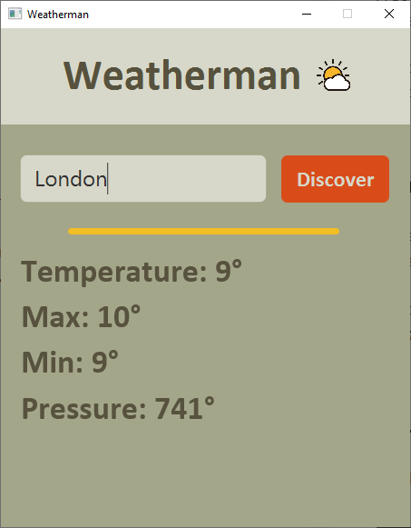

# Weatherman 

**Weatherman** - программа, представляющая из себя обычный погодник. Приложение использует сервис [OpenWheather](https://openweathermap.org/). Для получения информации о погоде отправляется URL запрос с названием города и индивидуальным ключом, в ответ получаем данные в json формате. 

## Используемые библиотеки:
- javafx
- json

## Используемые инструменты:
- SceneBuilder - для графического интерфейса программы.
- [OpenWheather](https://openweathermap.org/) - сервис, предоставляющий данные о погоде.

## Demo:

